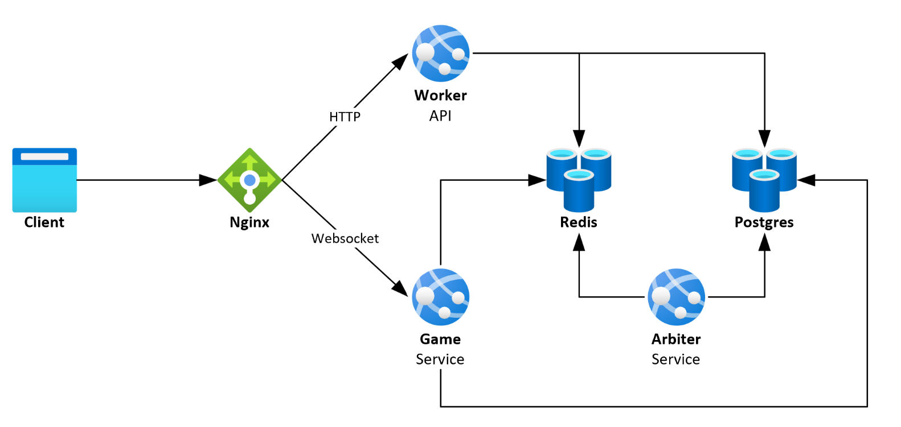

# Delta
Delta is a turn-based online word game where players compete to transform a starter word into a new word by changing one letter at a time.

**WORK IN PROGRESS**

# Table of Contents
- [Gettings Started](#getting-started)
- [Architecture](#architecture)
- [References](#references)


# Getting Started
Steps to run this code on Windows

### Prerequisites
Ensure you have the following installed:
1. Git
1. Docker Desktop (Make sure it is running)
1. Node.js (Version 20 or higher)
1. Go (Version 1.21 or higher)

### Setup Development Environment
1. Clone repo
1. Install local dependencies
    
    Navigate to vue app directory
    ```
    cd frontend/app
    ```
    Install dependencies
    ```
    npm install
    ```
1. Create SSL certificates
    
    Create a folder called certs
    ```
    mkdir -p gateway/certs
    ```
    Generate certificates
    ```
    openssl req -x509 -nodes -days 365 -newkey rsa:2048 \
        -keyout gateway/certs/localhost.key \
        -out gateway/certs/localhost.crt
    ```
1. Start the application
    
    Build and start all services using Docker Compose:
    ```
    docker compose -f docker-compose.local.yml up -d --build
    ```

1. Run database migration
    
    The database starts empty. You need to apply the schema using Liquibase. Run this command
    ```
    docker compose -f docker-compose.local.yml --rm migration update
    ```

# Architecture


### Data Storage
***Redis*** stores hot data:
- Live game data
- Matchmaking queue
- User sessions
- Pub/Sub

***Postgres*** stores persistent data:
- Game history
- User credentials and profile

### Services
**Worker** -> User authentication, profile management, matchmaking, querying historical game data

**Game** -> Websocket handling & game logic

**Updater** -> Ends games when a move has not been made after 100 seconds


# References
Resources I used while creating this project
- https://redis.io/blog/how-to-create-a-real-time-online-multi-player-strategy-game-using-redis/
- https://github.com/gofiber/recipes
- [Video - How Roblox Keeps Millions of Users up to Date with Redis Pub/Sub](https://www.youtube.com/watch?v=nXTxXSWBayg&list=TLGGrVGwPBoa-gcxOTExMjAyNA)